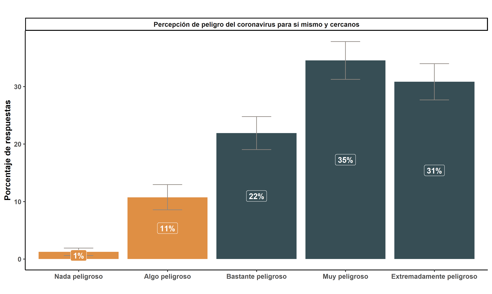
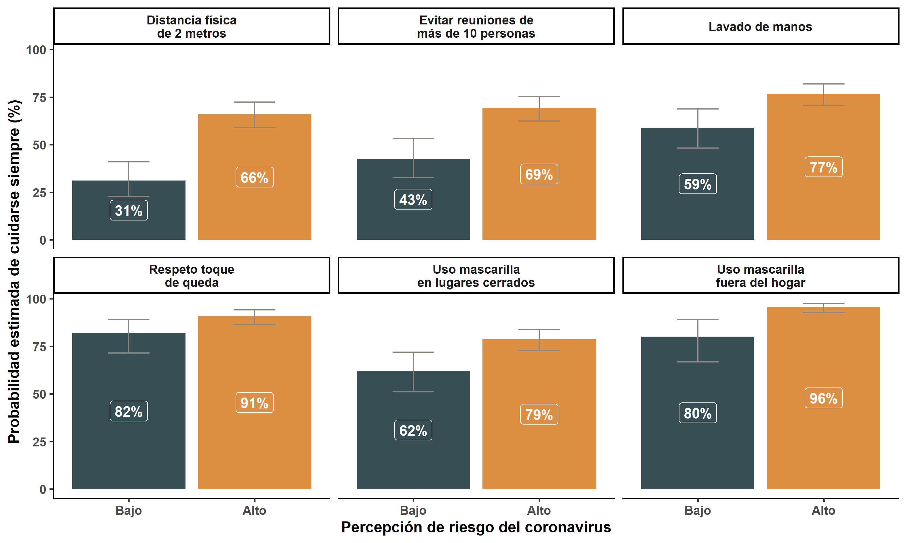
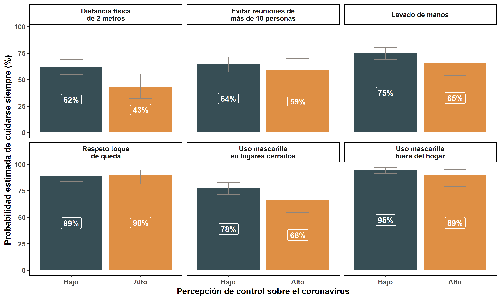
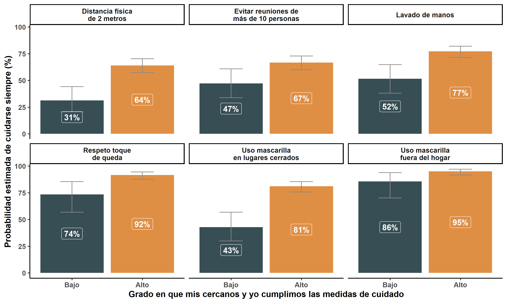
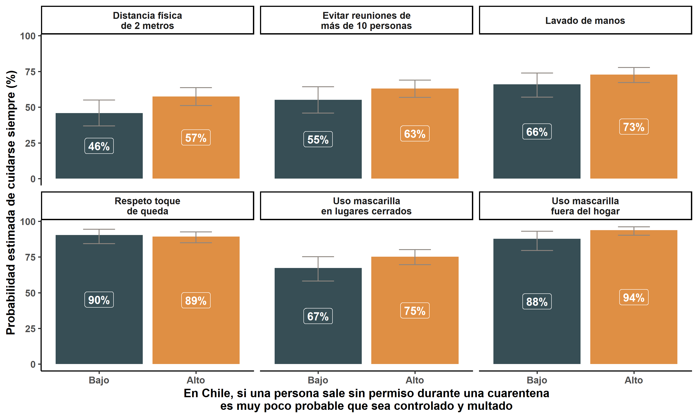

background-image: url("https://upload.wikimedia.org/wikipedia/commons/b/bc/Untitled_design.gif")
background-position: center
background-size: cover

class: inverse center


```{r setup, include=FALSE}
options(htmltools.dir.version = TRUE)
pacman::p_load(RefManageR)
# bib <- ReadBib("merit_pref_int.bib", check = FALSE)
```

```{r eval=FALSE, include=FALSE}
# Para que funcione el infinite moon reader, correr desde el root!
```

```{r setup2, include=FALSE, cache = FALSE}
require("knitr")
#options(htmltools.dir.version = FALSE)
pacman::p_load(RefManageR,icon)
opts_chunk$set(warning=FALSE,
             message=FALSE,
             echo=TRUE,
             cache = TRUE,fig.width=7, fig.height=5.2)
#download_fontawesome()
```

```{r xaringanExtra, echo=FALSE}
xaringanExtra::use_xaringan_extra(c("tile_view", "animate_css"))
```

```{r xaringanExtra-share-again, echo=FALSE}
xaringanExtra::use_share_again()
```


# Lanzamiento MOVID-IMPACT


.small[#### *Coronavirus Impact Monitor: Policy, Access, Control and Transectorial Consequences*

<br>
### CoV-IMPACT- C - ANID-COVID N° 960<br> [www.movid19.cl/](https://www.movid19.cl/cov-impact)  <br>

*28 de Enero, 2021*]
<br>

---
class: right bottom inverse 
<div class="logo-blank"></div> 
# 1. ¿Quiénes somos?

---
class: center
<div class="logo-right"></div> 

.center[
]

---
<div class="logo-right"></div> 

# 1. Quiénes somos

- Un equipo interdisciplinario de 36 investigadores/as: salud pública, epidemiología, sociología, antropología, economía, estadística, psicología. 

- **La Universidad de Chile patrocina** pero participan académicos de distintas casas de estudio


---
class: center inverse
<div class="logo-blank-right"></div> 

#  Objetivo

### Evaluar la respuesta del sistema de salud y la política social a la pandemia COVID-19 para retroalimentar futuros abordajes ante agentes con potencial epidémico

---
class: right bottom inverse

<div class="logo-blank"></div> 

# Línea de Encuestas

--

##  MOVID-19

--

## MOVID-IMPACT

---
background-image: url("input/img/movid4.gif")
background-position: right
background-size: small

<div class="logo-right"></div> 


## MOVID-19

- **Encuesta** panel online

  - Desde abril 2020 a la fecha ha monitoreado <br> hasta 40.000 participantes

  - [Ver informe metodológico](https://movid19.cl/informe/metodologico) [`r icon::fontawesome("book", style = "solid")`](https://movid19.cl/informe/metodologico)

--

- [Informes](https://movid19.cl/publicaciones/) sobre síntomas y prácticas <br>asociadas a la pandemia COVID-19 [`r icon::fontawesome("pen", style = "solid")`](https://movid19.cl/publicaciones/)

--

- [Sitio web](www.movid19.cl) y [Shiny App](https://movid19.cl/app) de código abierto y programa en [R `r icon::simple_icons$r`](https://movid19.cl/app)

---
<div class="logo-right"></div> 
### MOVID-IMPACT
### Metodología
- **Temporalidad**: transversal combinado ( 1° medición en diciembre 2020 y 2° en abril 2021)
---
.center[]
.tiny[**Figura 0.** Evolución de los casos contagiados por COVID-19 de marzo a la fecha. Fuente: [Ministerio de la Ciencia](https://raw.githubusercontent.com/MinCiencia/Datos-COVID19/master/output/producto5/TotalesNacionales_T.csv)]

---
<div class="logo-right"></div> 

## MOVID-IMPACT: Metodología

- **Encuesta telefónica**
  - Terreno realizado por el [Centro de Encuestas UC](http://www.encuestas.uc.cl/) entre el 4 y 22 de diciembre
  
--

- **Diseño muestral**
  - Población objetivo: mayores de 18 años que residen en zonas urbanas de Chile
  - 1° medición *n = 1.261 casos*

---
background-image: url("input/img/movid-impact.png")
background-position: center
background-size: 742px 430px

<div class="logo-right"></div> 

### Dimensiones MOVID-IMPACT

---
class: center inverse middle

<div class="logo-blank"></div> 

### Principales resultados
## ¿Cuáles son las barreras al cuidado en pandemia en Chile?

---
class: center middle

<div class="logo-blank"></div> 

# ¿Cuánto nos cuidamos del COVID-19 en Chile?

---
<div class="logo-right"></div> 
.tiny[*¿Cuánto nos cuidamos del COVID-19 en Chile?*]
.center[]
.small[**Figura 1.** Proporción de personas que indican *"Siempre"* cumplir las medidas de cuidado señaladas (*n=1.261 casos*)]

---
class: center inverse middle

<div class="logo-blank"></div> 

# Barreras al cuidado en pandemia en Chile

---
class: center middle

<div class="logo-right"></div> 

## 1. Barreras **socio-económicas**
---
.tiny[<div class="logo-right"></div> 
*1. Barreras **socio-económicas***]
.center[]
.small[**Figura 2.** Prácticas de cuidados según si encuestado trabaja o no (*n= 1.261 casos*)]
---
class: center middle
<div class="logo-right"></div> 
## 2. Barreras de **salud mental**
---
.tiny[<div class="logo-right"></div> 
*2. Barreras de **salud mental***]
.center[]
.small[**Figura 3.** Proporción de personas que reportan síntomas depresivos (*n= 1.261 casos*)]
---
.tiny[<div class="logo-right"></div> 
*2. Barreras de **salud mental***]
.center[]
.small[**Figura 4.** Prácticas de cuidado según síntomas depresivos (*n= 1.261 casos*)]
---
class: center middle
<div class="logo-right"></div> 
## 3. Percepción de **riesgo del coronavirus**
---
.tiny[<div class="logo-right"></div> 
*3. Percepción de **riesgo del coronavirus***]
.center[]
.small[**Figura 5.** Percepción de riesgo del coronavirus (*n= 1.261 casos*)]
---
.tiny[<div class="logo-right"></div> 
*3. Percepción de **riesgo del coronavirus***]
.center[]
.small[**Figura 4.** Percepción de control sobre el coronavirus (*n= 1.261 casos*)]
---
class: inverse 
.tiny[*3. Percepción de **riesgo del coronavirus***]
.center[]
.small[Figura 4. Probabilidades estimadas de cuidarse según percepción de riesgo (*n= 1.261 casos*)]
---
class: inverse 
.tiny[*3. Percepción de **riesgo del coronavirus***]
.center[]
.small[Figura 4. Probabilidades estimadas de cuidarse según percepción de control (*n= 1.261 casos*)]
---
class: center middle
<div class="logo-right"></div> 
## 4. Percepción de **normas sociales**
---
.tiny[<div class="logo-right"></div> 
4. Percepción de **normas sociales**]
.center[]
.tiny[**Figura 5.** Percepción sobre cuidados que toman otros (*n= 1.261*)]
---
class: inverse
.tiny[*4. Percepción de normas sociales*]
.center[]
.tiny[Figura 6. Probabilidades estimadas de cuidado según cuidados de otros (*n= 1.261*)]
---
class: center middle
<div class="logo-right"></div> 
## 5. Percepciones de **fiscalización** 
---
.tiny[<div class="logo-right"></div> 
*5. Percepciones de fiscalización*]
.center[]
.tiny[**Figura 7.**Percepción de fiscalización por no cumplir normas sanitarias (*n= 1.261*)]
---
class: inverse
.tiny[*5. Percepciones de fiscalización*]
.center[]
.tiny[Figura 8. Probabilidades estimadas de cuidado según percepción de fiscalización (*n= 1.261*)]
---

class: center middle

<div class="logo-blank"></div> 

# ¿Cómo reducir las **barreras al cuidado en la pandemia por COVID-19**?

---
class: center inverse middle

<div class="logo-blank-right"></div> 

### 1. Barreras socio-económicos
- Promover permisos para teletrabajar
- Horarios de trabajo diferidos en los sectores económicos más concentrados (grandes empresas y productivos)
- Pago de transporte a trabajadores de estos sectores o esenciales

--

### 2. Barreras de salud mental
- Aumentar el presupuesto destinado a salud mental, focalizando los recursos en la atención primaria de salud
- Acciones de prevención y tratamiento tradicionales pueden ser potenciadas a través del uso de internet y plataformas digitales

---
class: center inverse middle

<div class="logo-blank-right"></div> 

### 3. Comunicación de riesgos
- Comunicar adecuadamente los riesgos del coronavirus para distintas poblaciones
- Evitar dar señales de mejora en momentos de gravedad de la crisis

--

### 4. Comunicar normas sociales
- Comunicar ejemplos de otras personas y autoridades que cumplen con las normas
- Evitar destacar constantemente casos de incumplimiento (medios de comunicación)

### 5. Fiscalización del cumplimiento de medidas sanitarias
- Aumentar fiscalización de cumplimiento de medidas sanitarias
- Aumentar comunicación de fiscalización a la ciudadanía
---
class: inverse center middle
<div class="logo-blank-right"></div> 

### ¡Muchas gracias!

*Para más información*

# [`r icon::fontawesome$solid$'mouse-pointer'` www.movid19.cl/](www.movid19.cl/)

# [`r icon::simple_icons$github` github/CoV-IMPACT-C ](https://github.com/CoV-IMPACT-C)

---
class: inverse center middle
<div class="logo-blank-right"></div> 

*Equipo a cargo del análisis de la encuesta:*

- Valentina Andrade [`r icon::simple_icons$github`](https://github.com/valentinaandrade)
- Cristóbal Moya [`r icon::simple_icons$github`](https://github.com/Crismoc)
- Monica Gerber [`r icon::simple_icons$github`](https://github.com/mmgerber)

---
background-image: url("https://upload.wikimedia.org/wikipedia/commons/b/bc/Untitled_design.gif")
background-position: center
background-size: cover

class: inverse center

# Lanzamiento MOVID-IMPACT


.small[#### *Coronavirus Impact Monitor: Policy, Access, Control and Transectorial Consequences*

<br>
### CoV-IMPACT- C - ANID-COVID N° 960<br> [www.movid19.cl/](https://www.movid19.cl/cov-impact)  <br>

*28 de Enero, 2021*]
<br>

```{r metathis, echo=FALSE}
library(metathis)
meta() %>%
  meta_name("github-repo" = "CoV-IMPACT-C/slides") %>% 
  meta_social(
    title = "CoV-IMPACT-C",
    description = paste(
      "ANID-COVID N°960",
      "Lanzamiento MOVID-IMPACT"
    ),
    url = "https://www.movid19.cl/",
    image = "https://www.movid19.cl/presentaciones.png",
    image_alt = paste(
      "CoV-IMPACT-C", 
      "ANID-COVID N°960", 
      "Lanzamiento MOVID-IMPACT"
    ),
    og_type = "website",
    og_author = "Valentina Andrade",
    twitter_card_type = "summary_large_image",
    twitter_creator = "@valentiandrade",
    twitter_site = "@valentiandrade"
  )
```

```{r print, echo = F}
pagedown::chrome_print(input = "02presentacion.html", output = "output/02presentacion.pdf", format = "pdf")
```
