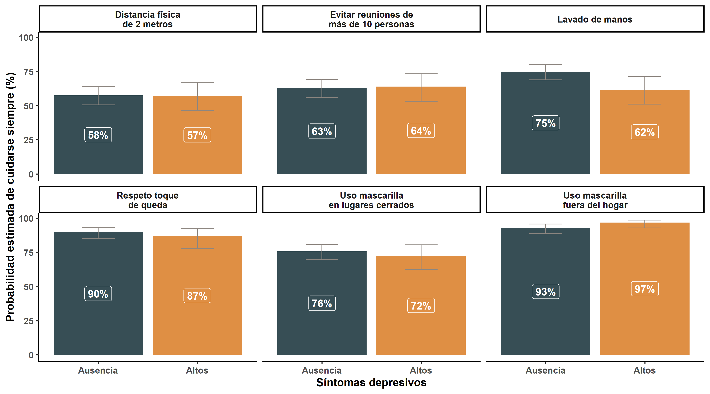
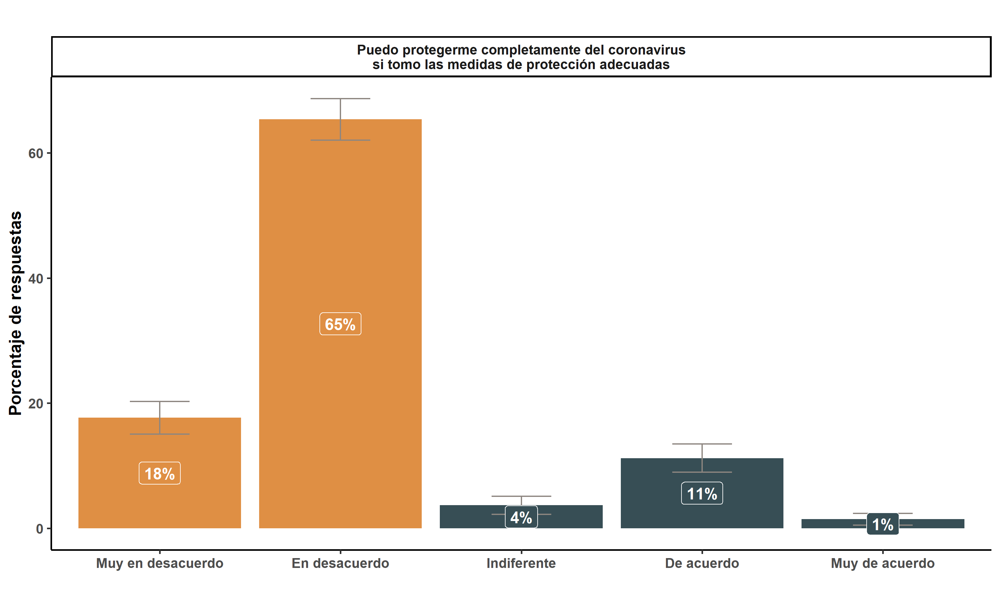

background-image: url("https://upload.wikimedia.org/wikipedia/commons/b/bc/Untitled_design.gif")
background-position: center
background-size: cover

class: inverse center


```{r setup, include=FALSE}
options(htmltools.dir.version = TRUE)
pacman::p_load(RefManageR)
# bib <- ReadBib("merit_pref_int.bib", check = FALSE)
```

```{r eval=FALSE, include=FALSE}
# Para que funcione el infinite moon reader, correr desde el root!
```

```{r setup2, include=FALSE, cache = FALSE}
require("knitr")
#options(htmltools.dir.version = FALSE)
pacman::p_load(RefManageR,icon)
opts_chunk$set(warning=FALSE,
             message=FALSE,
             echo=TRUE,
             cache = TRUE,fig.width=7, fig.height=5.2)
#download_fontawesome()
```

```{r xaringanExtra, echo=FALSE}
xaringanExtra::use_xaringan_extra(c("tile_view", "animate_css"))
```

```{r xaringanExtra-share-again, echo=FALSE}
xaringanExtra::use_share_again()
```


# Lanzamiento MOVID-IMPACT


.small[#### *Coronavirus Impact Monitor: Policy, Access, Control and Transectorial Consequences*

<br>
### CoV-IMPACT- C - ANID-COVID N° 960<br> [www.movid19.cl/](https://www.movid19.cl/cov-impact)  <br>

*28 de Enero, 2021*]
<br>

---
class: right bottom inverse 
<div class="logo-blank"></div> 
# 1. ¿Quiénes somos?

---
class: center
<div class="logo-right"></div> 

.center[
]

---
<div class="logo-right"></div> 

# 1. Quiénes somos

- Un equipo interdisciplinario de 36 investigadores/as: salud pública, epidemiología, sociología, antropología, economía, estadística, psicología. 

- **La Universidad de Chile patrocina** pero participan académicos de distintas casas de estudio


---
class: center inverse
<div class="logo-blank-right"></div> 

#  Objetivo

### Evaluar la respuesta del sistema de salud y la política social a la pandemia COVID-19 para retroalimentar futuros abordajes ante agentes con potencial epidémico

---
class: right bottom inverse

<div class="logo-blank"></div> 

# Línea de Encuestas

--

##  MOVID-19

--

## MOVID-IMPACT

---
background-image: url("input/img/movid4.gif")
background-position: right
background-size: small

<div class="logo-right"></div> 


## MOVID-19

- **Encuesta** panel online

  - Desde abril 2020 a la fecha ha monitoreado <br> hasta 40.000 participantes

  - [Ver informe metodológico](https://movid19.cl/informe/metodologico) [`r icon::fontawesome("book", style = "solid")`](https://movid19.cl/informe/metodologico)

--

- [Informes](https://movid19.cl/publicaciones/) sobre síntomas y prácticas <br>asociadas a la pandemia COVID-19 [`r icon::fontawesome("pen", style = "solid")`](https://movid19.cl/publicaciones/)

--

- [Sitio web](www.movid19.cl) y [Shiny App](https://movid19.cl/app) de código abierto y programa en [R `r icon::simple_icons$r`](https://movid19.cl/app)

---
<div class="logo-right"></div> 

## MOVID-IMPACT
### Metodología
- **Temporalidad**
  - Transversal combinado ( 1° medición en diciembre 2020 y 2° en abril 2021)
--

  - Gif conTendencias de números de contagiados y muertos 

---
<div class="logo-right"></div> 

## MOVID-IMPACT
### Metodología

- **Encuesta telefónica**
  - Terreno realizado por el [Centro de Encuestas UC](http://www.encuestas.uc.cl/)
  
--

- **Diseño muestral**
  - Población objetivo: mayores de 18 años que residen en zonas urbanas de Chile
  - 1° medición *n = 1.261 casos*


---
background-image: url("input/img/movid-impact.png")
background-position: center
background-size: 742px 430px

<div class="logo-right"></div> 

### Dimensiones MOVID-IMPACT

---
class: center inverse middle

<div class="logo-blank"></div> 

## 3. Principales resultados

---
class: center middle

<div class="logo-blank"></div> 

# ¿Cuánto nos cuidamos del COVID-19 en Chile?

---
<div class="logo-right"></div> 
.tiny[*¿Cuánto nos cuidamos del COVID-19 en Chile?*]

.center[]
.small[**Figura 1.** Proporción de personas que indican *"Siempre"* cumplir alguna de las medidas de cuidado señaladas (*n=1.261 casos*)]
---
class: center inverse middle

<div class="logo-blank"></div> 

# ¿Por qué no nos cuidamos del COVID-19 en Chile?

---
class: center middle

<div class="logo-right"></div> 

## 1. Porque no creemos que el COVID-19<br>sea un **peligro real**
---
.tiny[<div class="logo-right"></div> 
*1. Porque no creemos que el COVID-19 sea un peligro real*]

.center[]

.small[**Figura 2.** Distribución de la percepción de riesgo en la población (*n= 1.261 casos*)]
---
class: inverse 
.tiny[*1. Porque no creemos que el COVID-19sea un peligro real*]

.center[]
.small[Figura 3. Probabilidades predichas de la percepción de riesgo en la población (*n= 1.261 casos*)]
---
class: center middle

<div class="logo-right"></div> 

## 2. Porque sentimos que nos cuidamos 

---
.tiny[<div class="logo-right"></div> 
*2. Porque sentimos que nos cuidamos*]
.center[]
.tiny[**Figura 4.** Distribución de la percepción de cuidado en la población (*n= 1.261*)]
---
class: inverse
.tiny[*2. Porque sentimos que nos cuidamos*]
.center[]
.tiny[Figura 5. Probabilidades predichas de la percepción de cuidado (*n= 1.261*)]
---
class: center middle

<div class="logo-right"></div> 

## 3. Porque nos pasará nada si no seguimos las reglas 

---
.tiny[<div class="logo-right"></div> 
*3. Porque nos pasará nada si no seguimos las reglas*]
.center[]
.tiny[**Figura 6.** Distribución de la percepción de sanciones legales por no cumplir normas sanitarias (*n= 1.261*)]
---
class: inverse
.tiny[*3. Porque nos pasará nada si no seguimos las reglas*]
.center[]
.tiny[Figura 7. Probabilidades predichas de la percepción de sanciones legales por no cumplir normas sanitarias (*n= 1.261*)]

---
class: center middle

<div class="logo-right"></div> 

## 4. Porque los demás tampoco lo hacen 

---
.tiny[<div class="logo-right"></div> 
*4. Porque los demás tampoco lo hacen*]
.center[]
.tiny[**Figura 8.** Distribución de la percepción del cumplimiento de normas sanitarias del resto de la población (*n= 1.261*)]
---
class: inverse
.tiny[*4. Porque los demás tampoco lo hacen*]
.center[]
.tiny[Figura 9. Probabilidades predichas de la percepción cumplimiento de normas sanitarias de la población(*n= 1.261*)]
---
class: center middle

<div class="logo-blank"></div> 

# ¿Cómo promovemos el respeto a las **medidas de cuidado de COVID-19**?

---
class: center inverse middle

<div class="logo-blank-right"></div> 

### 1. Comunicación de riesgos

--

### 2. Fiscalización real y comunicada a la ciudadanía

--

### 3. Comunicar normas sociales

---
class: inverse center middle
<div class="logo-blank-right"></div> 

### ¡Muchas gracias!

*Para más información*

# [`r icon::fontawesome$solid$'mouse-pointer'` www.movid19.cl/](www.movid19.cl/)

# [`r icon::simple_icons$github` github/CoV-IMPACT-C ](https://github.com/CoV-IMPACT-C)

---
background-image: url("https://upload.wikimedia.org/wikipedia/commons/b/bc/Untitled_design.gif")
background-position: center
background-size: cover

class: inverse center

# Lanzamiento MOVID-IMPACT


.small[#### *Coronavirus Impact Monitor: Policy, Access, Control and Transectorial Consequences*

<br>
### CoV-IMPACT- C - ANID-COVID N° 960<br> [www.movid19.cl/](https://www.movid19.cl/cov-impact)  <br>

*28 de Enero, 2021*]
<br>

```{r metathis, echo=FALSE}
library(metathis)
meta() %>%
  meta_name("github-repo" = "CoV-IMPACT-C/slides") %>% 
  meta_social(
    title = "CoV-IMPACT-C",
    description = paste(
      "ANID-COVID N°960",
      "Lanzamiento MOVID-IMPACT"
    ),
    url = "https://www.movid19.cl/",
    image = "https://www.movid19.cl/presentaciones.png",
    image_alt = paste(
      "CoV-IMPACT-C", 
      "ANID-COVID N°960", 
      "Lanzamiento MOVID-IMPACT"
    ),
    og_type = "website",
    og_author = "Valentina Andrade",
    twitter_card_type = "summary_large_image",
    twitter_creator = "@valentiandrade",
    twitter_site = "@valentiandrade"
  )
```
