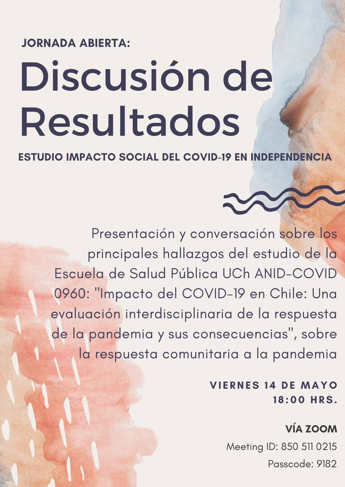
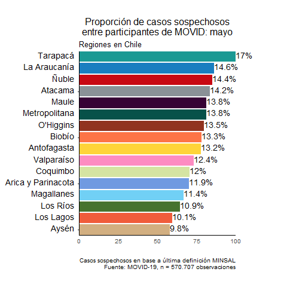
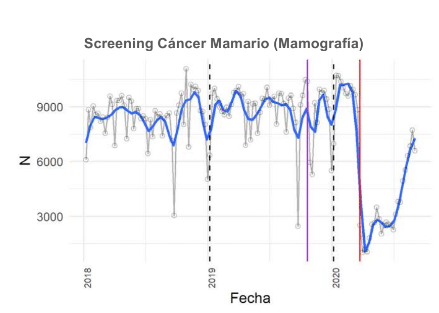
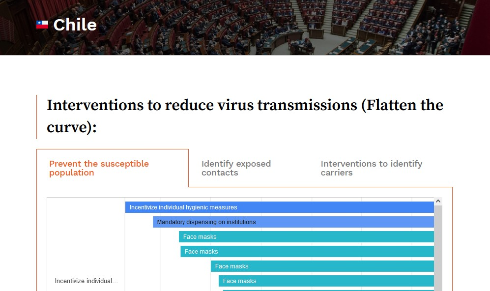
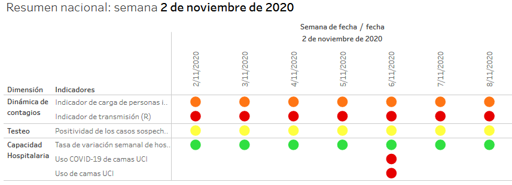
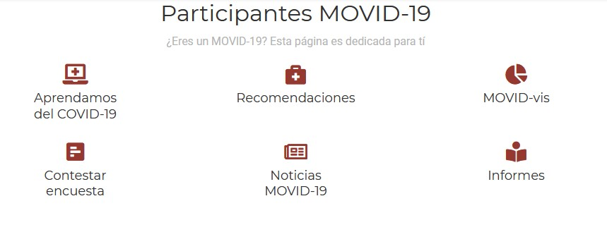
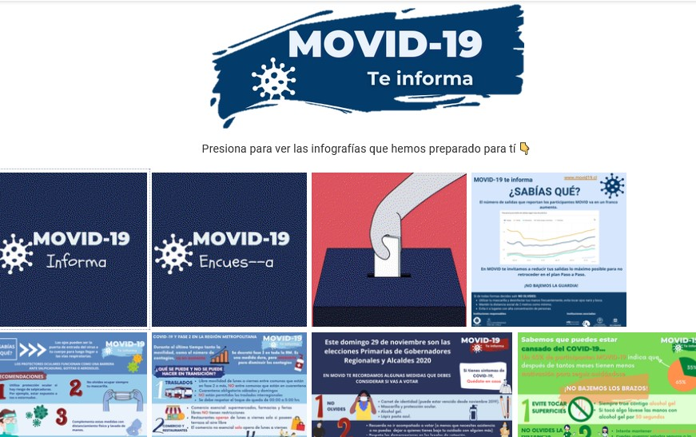
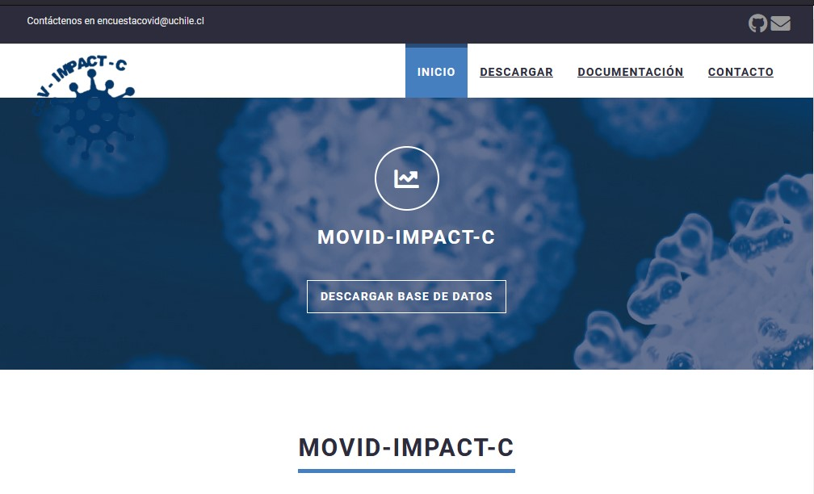
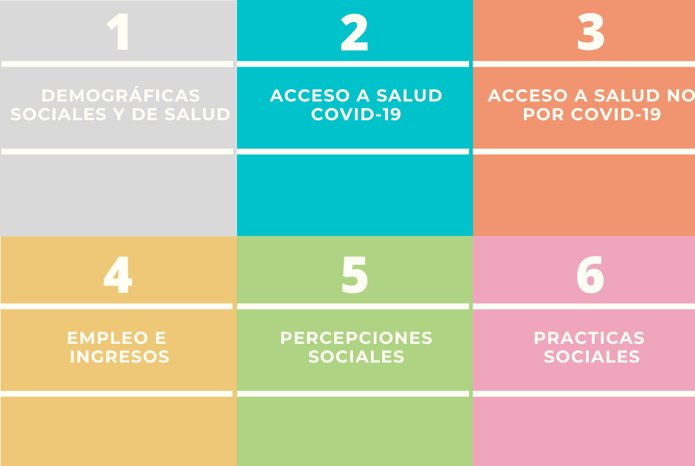

background-image: url("https://www.contrapuntonoticias.com/wp-content/uploads/2020/12/a8d866c87e75ae65af8a3f167ee1e8f6.gif")
background-position: center
background-size: contain

class: inverse center


```{r setup, include=FALSE}
options(htmltools.dir.version = TRUE)
pacman::p_load(RefManageR)
# bib <- ReadBib("merit_pref_int.bib", check = FALSE)
```

```{r eval=FALSE, include=FALSE}
# Para que funcione el infinite moon reader, correr desde el root!
```

```{r setup2, include=FALSE, cache = FALSE}
require("knitr")
#options(htmltools.dir.version = FALSE)
#remotes::install_github("mitchelloharawild/icons")
pacman::p_load(RefManageR,icons)
opts_chunk$set(warning=FALSE,
             message=FALSE,
             echo=TRUE,
             cache = TRUE,fig.width=7, fig.height=5.2)
#icons::download_fontawesome()
```

```{r xaringanExtra, echo=FALSE}
xaringanExtra::use_xaringan_extra(c("tile_view", "animate_css", "freezeframe"))
```

```{r xaringanExtra-share-again, echo=FALSE}
xaringanExtra::use_share_again()
```


## Proyecto de vinculación

### Universidad San Sebastián y CoV-IMPACT- C

.small[ANID-COVID N° 960

<br><br>
Valentina Andrade<br> [www.movid19.cl/](https://www.movid19.cl/)  <br>

<br>*Agosto, 2021*]
<br>
---
class: right bottom inverse 
<div class="logo-blank"></div> 
<div class="logo-ussb-right"></div> 
# 0. Contexto

---
class: center 

<center>
<iframe width="1300" height="700" src="https://www.youtube.com/embed/HSK5OykXF-o?&autoplay=1"  frameborder="0"; autoplay" allowfullscreen></iframe>
</center>

---
class: right center inverse

# MOVID-19

--

## Un proyecto que entender el avance de la pandemia en Chile

---
class: right bottom inverse 
<div class="logo-blank"></div>
<div class="logo-ussb-right"></div> 

# 1. ¿Quiénes somos?

---
class: center
<div class="logo-right"></div> 

.center[
]

---
<div class="logo-right"></div> 
<div class="logo-uss-left"></div> 

# 1. Quiénes somos

- Un equipo interdisciplinario de 36 investigadores/as: salud pública, epidemiología, sociología, antropología, economía, estadística, psicología. 

- Proyecto patrocinado por **la Universidad de Chile** 

- Participan académicos de distintas casas de estudio

--

- Entre ellas ¡la profesora **M. Monsalves y J. Aubert**!


---
class: center inverse
<div class="logo-blank-right"></div> 
<div class="logo-ussb-left"></div> 


# El equipo ha buscado retroalimentar los distintos abordajes a la pandemia

--

### ¿Cómo? 🤔
---
background-image: url("input/img/discusion.gif")
background-position: center
background-size: contain

class: center middle inverse
<div class="logo-blank"></div> 

## 1. Entrevistas


--


---
class: center inverse middle

<div class="logo-blank"></div> 
<div class="logo-ussb-right"></div> 
## 2. Encuestas

---
<div class="logo-right"></div> 

## 1. MOVID-19

- **Encuesta** Panel Online 💻: [informe metodológico](https://movid19.cl/informe/metodologico)

--

- Síntomas y Prácticas Asociadas a COVID-19💉🦠: [ ¡revisa los informes!](https://movid19.cl/publicaciones/)

--

- [Sitio web](www.movid19.cl) y [Shiny App](https://movid19.cl/app) de código abierto y programa en R

.right[]


---
<div class="logo-right"></div> 

## 2. MOVID-IMPACT

- **Encuesta** transversal, representativa y telefónica 📞 

--

- Síntomas, acceso a servicios de salud y características sociodemográficas 💊🦠


--

- Análisis basados en una muestra probabilística servirán a todas las líneas.

--

- Trabajo de campo: diciembre 2021

---
class: center inverse middle

<div class="logo-blank"></div> 
<div class="logo-ussb-right"></div> 

## ¡Pero antes de contarles más sobre MOVID-IMPACT! 🤓

--

# ¿Qué se ha hecho con estos instrumentos?

---
class: middle 
<div class="logo-right"></div> 

## Cada línea del equipo ha contribuido de distintas formas 👨‍👩‍👦‍👦

---
class: right bottom inverse

<div class="logo-blank"></div> 
<div class="logo-ussb-right"></div> 

## 3. Líneas de trabajo

--

### 3.1 Acceso

--

### 3.2 Social

--

### 3.3 Impacto

--

### 3.4 Indicadores

---
class:center inverse middle

<div class="logo-blank"></div> 
<div class="logo-ussb-right"></div> 

## 3.1 Acceso COVID-19 y no relacionado a COVID-19

---
<div class="logo-right"></div> 

### 3.1 Acceso COVID-19 y no COVID-19

-  [“Propiedades diagnósticas de las definiciones de caso sospechoso de COVID-19 en Chile”](https://github.com/CoV-IMPACT-C/Diagnostic-criteria-COVID19-Chile)en la Revista Panamericana de Salud Pública.  (*en prensa*)
[`r icons::fontawesome("rocket", style = "solid")`](https://github.com/CoV-IMPACT-C/Diagnostic-criteria-COVID19-Chile)

.center[
]
---
<div class="logo-right"></div> 

### 3.1 Acceso COVID-19 y no COVID-19

- ["Gender disparities in access to care for time-sensitive conditions during COVID-19 pandemic in Chile"](https://www.medrxiv.org/content/10.1101/2020.09.11.20192880v1) (*under review*)
[`r icons::fontawesome("book", style = "solid")`](https://www.medrxiv.org/content/10.1101/2020.09.11.20192880v1)
[`r icons::fontawesome("rocket", style = "solid")`](https://github.com/CoV-IMPACT-C/gender-impact-access-covid)

.center[
]
---
<div class="logo-right"></div> 

### 3.1 Acceso COVID-19 y no COVID-19

- [¿Cuál ha sido el impacto de la pandemia en el acceso a atenciones de salud? Un análisis para la adaptación de nuestro sistema de salud](https://www.movid19.cl/publicaciones/decimo-informe/)
[`r icons::fontawesome("rocket", style = "solid")`](https://github.com/CoV-IMPACT-C/acceso-nocovid)

--

- [¿Cuál ha sido el impacto de la pandemia en el acceso a servicios ambulatorios vinculados al cáncer?](https://www.dropbox.com/s/zlk4b2269npu9xi/Analisis%20UCH%20-%20acceso%20a%20cancer%20y%20pandemia.pdf?dl=0)

.center[
]

---
class: center inverse middle

<div class="logo-blank"></div> 
<div class="logo-ussb-right"></div> 

## 3.2 Social

---
<div class="logo-right"></div> 

## 3.2 Social 

- [Taking care of each oyher: how can we increase with personal protective measures during the COVID pandemic in Chile?](https://github.com/CoV-IMPACT-C/Stay-home-stay-safe-COVID19-Chile) *Political Psychology* 
[`r icons::fontawesome("rocket", style = "solid")`](https://github.com/CoV-IMPACT-C/Stay-home-stay-safe-COVID19-Chile)

.center[
]

---
<div class="logo-right"></div> 

## 3.2 Social 


- [¿Cuál ha sido el impacto de la pandemia en las labores de cuidado?: Un análisis desde una perspectiva de género](https://www.movid19.cl/publicaciones/decimo-informe/)
[`r icons::fontawesome("book", style = "solid")`](https://www.movid19.cl/publicaciones/decimo-informe/)
[`r icons::fontawesome("rocket", style = "solid")`](https://github.com/CoV-IMPACT-C/cuidados)

.center[]

---
class: center inverse middle

<div class="logo-blank"></div> 
<div class="logo-ussb-right"></div> 

## 3.3 Impacto

---
<div class="logo-right"></div> 

## 3.3 Impacto

- **Evaluar el impacto de las políticas públicas implementadas para responder a la pandemia COVID-19.** 

---

### Aportando evidencia a nivel internacional 🌎

--

### en [Polimap.org](https://polimap.org/chile/)


---
class: center inverse middle

<div class="logo-blank"></div> 
<div class="logo-ussb-right"></div> 

##  3.4 Indicadores

---
<div class="logo-right"></div> 

##  Indicadores 

- en iniciativas como **ICOVID** [`r icons::fontawesome("chart-pie", style = "solid")`](https://www.icovidchile.cl/)

.center[
]

---
class: center middle 

# ¿Todo eso? 😱

--

## ¡Sí! Y mucho más

--

### No solo hemos aportado con evidencia 🎓, sino también retribuyendo a la ciudadanía 🤝🏼
---
class: center inverse middle

<div class="logo-blank"></div> 
<div class="logo-ussb-right"></div> 

## Vinculación con el medio 🤝🏼

---
<div class="logo-right"></div> 

## Sitio participantes 🌐



---

### Donde también han contribuido de manera importante <br> estudiantes de la USS ✏


---
<div class="logo-right"></div> 

## Contacto con participantes

- 1. Correo 📬📩

- 2. Infografías 📊 🎨

---


# Y ahora se viene un aporte muy importante...

--

# ¡El de ustedes! 👏

--

## ¡Vamos a ver cómo!

---
<div class="logo-right"></div> 

1. **Fuente de información**: encuesta [MOVID-IMPACT](https://movid-impact.netlify.app/)

--

2. **Análisis estadístico** 📊

--

3. **Aportar** con información relevante para la pandemia 💪

---
<div class="logo-right"></div> 

## 1. MOVID-IMPACT



[https://movid-impact.netlify.app/](https://movid-impact.netlify.app/)

---
# 2. Análisis estadístico


---

# 3. Aporte con información relevante para la pandemia

- Que tu trabajo de la Universidad no "quede tirado" en tus carpetas 📚📂

--

- Todo el esfuerzo que pones en tus evaluaciones puede servir de algo 💪

--

- ¡Y ser difundido en nuestro sitio web! 🌐

---
class: inverse center middle
<div class="logo-blank-right"></div> 
<div class="logo-ussb-left"></div> 

¡Muchas gracias!

Para más información

## [www.movid19.cl/](https://www.movid19.cl/)

## [https://movid-impact.netlify.app/](https://movid-impact.netlify.app/)

---
background-image: url("https://www.contrapuntonoticias.com/wp-content/uploads/2020/12/a8d866c87e75ae65af8a3f167ee1e8f6.gif")
background-position: center
background-size: contain

class: inverse center

<div class="logo-ussb-right"></div> 

## CoV-IMPACT- C
Coronavirus Impact Monitor: Policy, Access, Control and Transectorial Consequences

.small[ANID-COVID N° 960

<br><br>
Valentina Andrade<br> [www.movid19.cl/](https://www.movid19.cl/)  <br>]

.small[*Agosto, 2021*]
<br>]

```{r metathis, echo=FALSE}
library(metathis)
meta() %>%
  meta_name("github-repo" = "CoV-IMPACT-C/slides") %>% 
  meta_social(
    title = "CoV-IMPACT-C",
    description = paste(
      "ANID-COVID N°960"
    ),
    url = "https://movid-impact.netlify.app/",
    image = "https://www.movid19.cl/presentaciones.png",
    image_alt = paste(
      "CoV-IMPACT-C", 
      "ANID-COVID N°960", 
      "por Valentina Andrade"
    ),
    og_type = "website",
    og_author = "Valentina Andrade",
    twitter_card_type = "summary_large_image",
    twitter_creator = "@valentiandrade",
    twitter_site = "@valentiandrade"
  )
```

```{r print, echo = F, eval=FALSE}
pagedown::chrome_print(input = "03presentacion.html", output = "output/03presentacion.pdf", format = "pdf")
```
