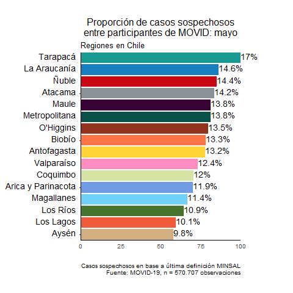
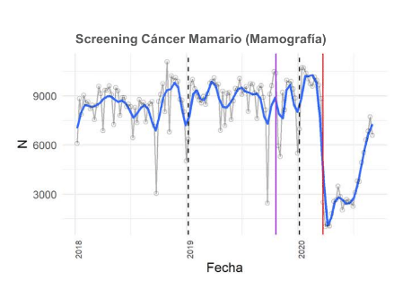
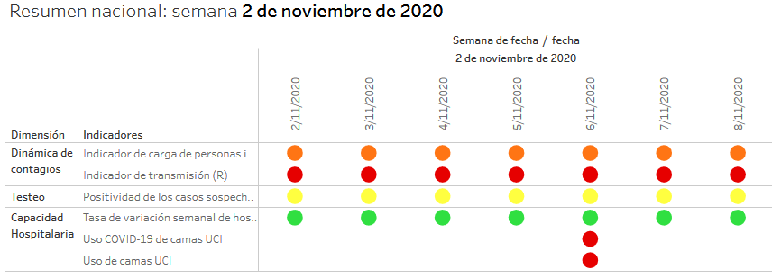

background-image: url("https://upload.wikimedia.org/wikipedia/commons/b/bc/Untitled_design.gif")
background-position: center
background-size: contain

class: inverse center


```{r setup, include=FALSE}
options(htmltools.dir.version = TRUE)
pacman::p_load(RefManageR)
# bib <- ReadBib("merit_pref_int.bib", check = FALSE)
```

```{r eval=FALSE, include=FALSE}
# Para que funcione el infinite moon reader, correr desde el root!
```

```{r setup2, include=FALSE, cache = FALSE}
require("knitr")
#options(htmltools.dir.version = FALSE)
pacman::p_load(RefManageR,icon)
opts_chunk$set(warning=FALSE,
             message=FALSE,
             echo=TRUE,
             cache = TRUE,fig.width=7, fig.height=5.2)
#download_fontawesome()
```

```{r xaringanExtra, echo=FALSE}
xaringanExtra::use_xaringan_extra(c("tile_view", "animate_css"))
```

```{r xaringanExtra-share-again, echo=FALSE}
xaringanExtra::use_share_again()
```


## CoV-IMPACT- C
Coronavirus Impact Monitor: Policy, Access, Control and Transectorial Consequences

.small[ANID-COVID N° 960

<br><br>
Valentina Andrade<br> [www.movid19.cl/](https://www.movid19.cl/)  <br>

Semana de Articulación COVID-19, ANID<br>*17 de Noviembre, 2020*]
<br>

---
class: right bottom inverse 
<div class="logo-blank"></div> 
# 1. ¿Quiénes somos?

---
class: center
<div class="logo-right"></div> 

.center[
]

---
<div class="logo-right"></div> 

# 1. Quiénes somos

- Un equipo interdisciplinario de 36 investigadores/as: medicina, sociología, antropología, economía, estadística, psicología. 

- **La Universidad de Chile patrocina** pero participan académicos de distintas casas de estudio


---
class: center inverse
<div class="logo-blank-right"></div> 

#  1.1 Objetivo

## Evaluar la respuesta del sistema de salud y la política social a la pandemia COVID-19 para retroalimentar futuros abordajes ante agentes con potencial epidémico

---

.center[
]
---
class: right bottom inverse

<div class="logo-blank"></div> 

# 2. Líneas transversales

--

## 2.1 Líneas Encuestas

--

## 2.2 Líneas Cualitativa

---
class: center inverse middle

<div class="logo-blank"></div> 

## 2.1 Líneas Encuestas

---
<div class="logo-right"></div> 

## MOVID-19

- **Encuesta** Panel Online: [informe metodológico](https://movid19.cl/informe/metodologico)

--

- Síntomas y Prácticas Asociadas a COVID-19: [informes](https://movid19.cl/publicaciones/)

--

- [Sitio web](www.movid19.cl) y [Shiny App](https://movid19.cl/app) de código abierto y programa en R

.right[]


---
<div class="logo-right"></div> 

## MOVID-IMPACT

- **Encuesta** dos olas, representativa y telefónica. 

--

- Síntomas, acceso a servicios de salud y características sociodemográficas.


--

- Análisis basados en modelos más robustos que sirven a cada línea

---
class: center inverse middle

<div class="logo-blank"></div> 

## 2.2 Línea Cualitativa

---
<div class="logo-right"></div> 

## Estudio de caso

- Independencia y San Joaquín

- **Entrevista** a 50 actores claves: organizaciones sociales, vecinales y sanitarias

- **Etnografía**

--

- **Aceptabilidad** de políticas públicas, ***adherencia** a intervenciones, prácticas de cuidado y efectos en salud

--

- **WP N°1**: *Artículo sobre cuidados colectivos y afrontamiento de la pandemia*

---
class: right bottom inverse

<div class="logo-blank"></div> 

## 3. Líneas temáticas

--

### 3.1 Acceso

--

### 3.2 Social

--

### 3.3 Impacto

--

### 3.4 Indicadores

---
class:center inverse middle

<div class="logo-blank"></div> 

## 3.1 Acceso

---
<div class="logo-right"></div> 

## 3.1 Acceso

- **Evaluar el acceso efectivo y la equidad de servicios de salud relacionados y no relacionados a COVID-19, en el contexto de la pandemia** 

---
<div class="logo-right"></div> 

## Acceso COVID-19

- **Paper N°1**: [“Propiedades diagnósticas de las definiciones de caso sospechoso de COVID-19 en Chile”](https://github.com/CoV-IMPACT-C/Diagnostic-criteria-COVID19-Chile)en la Revista Panamericana de Salud Pública.  (*por publicar*)
[`r icon::fontawesome("rocket", style = "solid")`](https://github.com/CoV-IMPACT-C/Diagnostic-criteria-COVID19-Chile)

.center[
]
---
<div class="logo-right"></div> 

## Acceso No-COVID-19: 

- **Paper N° 2**: ["Gender disparities in access to care for time-sensitive conditions during COVID-19 pandemic in Chile"](https://www.medrxiv.org/content/10.1101/2020.09.11.20192880v1) (*under review*)
[`r icon::fontawesome("book", style = "solid")`](https://www.medrxiv.org/content/10.1101/2020.09.11.20192880v1)
[`r icon::fontawesome("rocket", style = "solid")`](https://github.com/CoV-IMPACT-C/gender-impact-access-covid)

.center[
]
---
<div class="logo-right"></div> 

## Acceso No-COVID-19: 

- **Informe técnico N°1: **[¿Cuál ha sido el impacto de la pandemia en el acceso a atenciones de salud? Un análisis para la adaptación de nuestro sistema de salud](https://www.movid19.cl/publicaciones/decimo-informe/)
[`r icon::fontawesome("rocket", style = "solid")`](https://github.com/CoV-IMPACT-C/acceso-nocovid)

--

- **Informe técnico N°2: **[¿Cuál ha sido el impacto de la pandemia en el acceso a servicios ambulatorios vinculados al cáncer?](https://www.dropbox.com/s/zlk4b2269npu9xi/Analisis%20UCH%20-%20acceso%20a%20cancer%20y%20pandemia.pdf?dl=0)

.center[
]

---
<div class="logo-right"></div> 

## Working Papers

.small[
- **WP N°2:** *¿Se asocia el posponer el control de patologías crónicas a características sociales, demográficas o clínicas de las personas?*  
-  **WP N°3:** *Cómo se asocian distintas dimensiones de riesgo al COVID y conductas de atención de salud*
- **WP N°4:** *Trayectorias asistenciales de pacientes con enfermedades oncológicas durante la pandemia (INCANCER)*
]

---
class: center inverse middle

<div class="logo-blank"></div> 

## 3.2 Social

---
<div class="logo-right"></div> 

## 3.2 Social

- **Analizar el rol del contexto social en el que se inserta la pandemia en Chile en la aceptabilidad de las políticas públicas, la adherencia a intervenciones propuestas por las autoridades ** 
---
<div class="logo-right"></div> 

## 3.2 Social 

- **Paper N° 3**: [Stay home, stay safe: analysis of the compliance with stay-at-home policies in Chile during the COVID-19 pandemic](https://github.com/CoV-IMPACT-C/Stay-home-stay-safe-COVID19-Chile) *Political Psicology* (*under review*)
[`r icon::fontawesome("rocket", style = "solid")`](https://github.com/CoV-IMPACT-C/Stay-home-stay-safe-COVID19-Chile)

.center[
]

---
<div class="logo-right"></div> 

## 3.2 Social 

- **Informe técnico N°3: **[¿Cuál ha sido el impacto de la pandemia en las labores de cuidado?: Un análisis desde una perspectiva de género](https://www.movid19.cl/publicaciones/decimo-informe/)
[`r icon::fontawesome("book", style = "solid")`](https://www.movid19.cl/publicaciones/decimo-informe/)
[`r icon::fontawesome("rocket", style = "solid")`](https://github.com/CoV-IMPACT-C/cuidados)

.center[]
---
class: center inverse middle

<div class="logo-blank"></div> 

## 3.3 Impacto

---
<div class="logo-right"></div> 

## 3.3 Impacto

- **Evaluar el impacto de las políticas públicas implementadas para responder a la pandemia COVID-19.** 
---
<div class="logo-right"></div> 

## 3.3 Impacto 

- **Protocolo para registro en ClinicalTrials.gov** `r icon::fontawesome("vial", style = "solid")`

- Modelos de series de tiempo interrumpidas a nivel subnacional y meta-análisis con efectos aleatorios `r icon::fontawesome("chart-line", style = "solid")`

--

- Analizar si existe heterogeneidad de efecto en los niveles subnacionales

- **1.Viral spread** (*lockdown, curfew, School closure, remote work,closure of shopping malls, gyms, churches, parks, prohibition of mass gatherings, etc*)

--
- **2. Health systems response**(*testing capacity, n° ICU,  occupation critical beds*)

--

- **3.Mitigation strategies** (*direct social assistance, cash transfer*)

---
class: center inverse middle

<div class="logo-blank"></div> 

## 3.4 Indicadores

---
<div class="logo-right"></div> 

## 3.4 Indicadores

- **Desarrollar indicadores que permitan apoyar la toma de decisiones de aplicación y desescalamiento de intervenciones epidemiológicas para responder a una pandemia.** 
---
<div class="logo-right"></div> 

## 3.3 Impacto 

- **Indicadores han aportado en ICOVID** [`r icon::fontawesome("chart-pie", style = "solid")`](https://www.icovidchile.cl/)

(*participa Dra. Fuentes, Dr. Cuadrado, Dr. Canals*)

.center[
]

--

- Propuesta de indicador resumen de riesgo

---
class: inverse center middle
<div class="logo-blank-right"></div> 

¡Muchas gracias!

Para más información

# [www.movid19.cl/](https://www.movid19.cl/)

---
background-image: url("https://upload.wikimedia.org/wikipedia/commons/b/bc/Untitled_design.gif")
background-position: center
background-size: contain

class: inverse center


## CoV-IMPACT- C
Coronavirus Impact Monitor: Policy, Access, Control and Transectorial Consequences

.small[ANID-COVID N° 960

<br><br>
Valentina Andrade<br> [www.movid19.cl/](https://www.movid19.cl/)  <br>]

.small[Semana de Articulación COVID-19, ANID<br>*17 de Noviembre, 2020*]
<br>]

```{r metathis, echo=FALSE}
library(metathis)
meta() %>%
  meta_name("github-repo" = "CoV-IMPACT-C/slides") %>% 
  meta_social(
    title = "CoV-IMPACT-C",
    description = paste(
      "ANID-COVID N°960",
      "Semana de Articulación COVID-19"
    ),
    url = "https://www.movid19.cl/",
    image = "https://www.movid19.cl/presentaciones.png",
    image_alt = paste(
      "CoV-IMPACT-C", 
      "ANID-COVID N°960", 
      "presentada en la Semana de la Articulación COVID-19 ANID por Valentina Andrade"
    ),
    og_type = "website",
    og_author = "Valentina Andrade",
    twitter_card_type = "summary_large_image",
    twitter_creator = "@valentiandrade",
    twitter_site = "@valentiandrade"
  )
```
